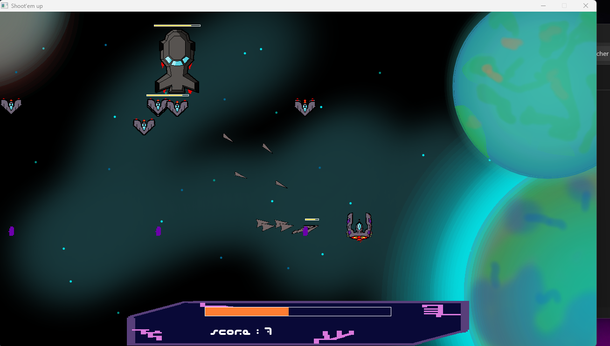

# Zexer

A little and simple shoot'em up, just for fun.

## HOW TO COMPILE AND RUN
- LINUX:
  1. go to your terminal
  2. use the command 'make' at the root of the project
  3. write './zexer', tap enter and here you go :)

- WINDOWS: **not available for now ! Ignore instructions below !**

  > You should be able to play Zexer without compiling, skipping steps 1 & 2 

  1. go to your terminal
  2. use the command 'make' at the root of the project
  3. copy-paste the content of dll folder at the root
  4. launch zexer.exe :)

## Notes
Musics (for now, all picked up on www.Pixabay.com, all free of use):
- ***Sexy Chillout Hip Hop Track - Come With Me*** by Keyframe_Audio
- ***Password Infinity*** by Evgeny_Bardyuzha
- ***Electronic Future Beats*** by QubeSounds

Sounds:
- metalBoom : remixed from ***Trap*** by Joseph SARDIN on bigsoundbank.com
> These songs are not meant to be a part of the project eternally, but hanks to their creators.
